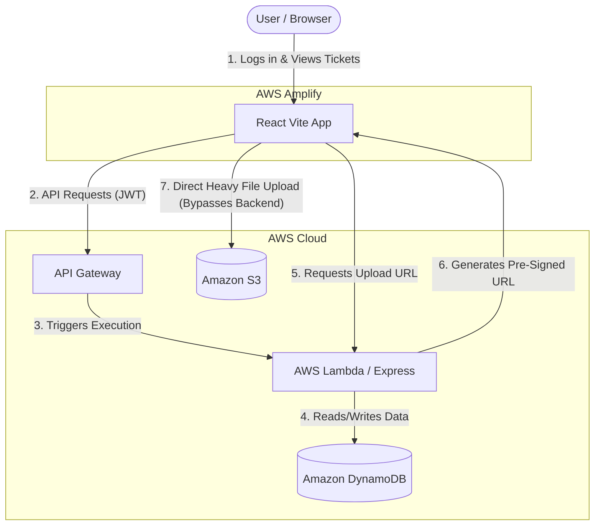

# ☁️ CloudDesk: Serverless Enterprise Support System


## 🌐 Live Demo & Deployment
- **Frontend (AWS Amplify):** [https://main.d2507pncrkso5o.amplifyapp.com/](https://main.d2507pncrkso5o.amplifyapp.com/)
- **Backend (API Gateway):** `https://xc94sskd0j.execute-api.eu-north-1.amazonaws.com/api`

### 🔑 Demo Login Credentials
To test the live application, please use the following credentials:
- **Username:** `admin`
- **Password:** `supersecretpassword`

---

## 📖 Project Overview

### The Business Problem
Enterprise customer support teams require highly available, fast, and secure platforms to manage incoming client issues. Traditional monolithic architectures suffer from high idle server costs, difficulty scaling during traffic spikes, and server bottlenecks when users upload heavy diagnostic files (like screenshots or video attachments).

### The Solution
**CloudDesk** is a 100% serverless, zero-idle-cost customer support ticketing system. By leveraging AWS Lambda and API Gateway, the compute layer scales infinitely and instantly to handle any volume of requests. By utilizing the **S3 Pre-Signed URL** architecture, heavy file uploads bypass the backend entirely, uploading directly from the client's browser to the cloud, ensuring maximum speed and zero server load.

---

## ✨ Key Features
- **🚀 Serverless Compute:** The Express backend runs entirely on AWS Lambda, scaling automatically and costing $0.00 when idle.
- **🔒 Direct-to-Cloud Uploads:** Uses cryptographic pre-signed URLs to allow users to securely upload attachments directly to Amazon S3.
- **🛡️ Stateless JWT Authentication:** Secure login system utilizing JSON Web Tokens stored locally.
- **⚡ NoSQL Persistence:** Ultra-fast read/write operations using Amazon DynamoDB.
- **🎨 Premium UI/UX:** A modern, highly responsive white-themed frontend built with React (Vite) and clean CSS.

---

## 🏗️ Architecture Diagram




---

## 🔄 Ticket Processing Lifecycle

1. **Authentication:** User logs in via React. Backend Lambda verifies credentials and issues a secure JWT.
2. **Metadata Request:** If the user attaches a file to a ticket, the frontend requests a temporary, time-limited cryptographic URL from the Lambda backend.
3. **Direct Upload:** The browser uploads the heavy image file directly to the S3 bucket using the pre-signed URL, bypassing the Node.js API completely.
4. **Data Persistence:** The frontend submits the final ticket details (including the final S3 public URL) to the backend.
5. **Database Insertion:** The Lambda function writes the final ticket object to the DynamoDB NoSQL table.

---

## 🧩 Component Responsibilities

| Component | Technology | Responsibility |
| :--- | :--- | :--- |
| **Frontend** | React (Vite) | Renders the premium UI, manages local JWT state, and handles direct S3 uploads. |
| **API Orchestrator** | AWS API Gateway | Acts as a greedy proxy (`/{proxy+}`), routing all HTTP requests to the Lambda function. |
| **Compute Engine** | Node.js / Express | Validates JWTs, processes business logic, and communicates with AWS SDKs. |
| **Database** | Amazon DynamoDB | Stores stateless ticket records, statuses, and priority levels. |
| **Object Storage** | Amazon S3 | Stores image attachments with strict CORS policies. |

---

## 🏷️ Ticket Lifecycles & Operational Modes

Tickets are routed based on strict states to ensure support teams can filter effectively:
- **Priority Modes:** `LOW` (General inquiry), `MEDIUM` (Standard issue), `HIGH` (Critical failure).
- **Status Modes:** `OPEN` (Requires attention), `IN_PROGRESS` (Agent assigned), `RESOLVED` (Issue closed).

---

## 🔐 Secure S3 Upload Layer (Direct-to-Cloud)
To prevent server bottlenecks and unauthorized data storage, CloudDesk implements a **Pre-Signed URL Strategy**:
- **Prevention of Server Crash:** Node.js limits memory. If 1,000 users upload 5MB images simultaneously, a standard server crashes. Bypassing the server and going straight to S3 eliminates this entirely.
- **Time-Limited Access:** The generated upload URLs expire in 60 seconds, preventing malicious reuse.
- **CORS Hardening:** The S3 bucket strictly only accepts `PUT` requests originating from the trusted AWS Amplify frontend domain.

---

## 📁 Project Structure

```text
CloudDesk/
├── backend/
│   ├── src/
│   │   ├── controllers/      # Route logic & AWS interactions
│   │   ├── middleware/       # JWT Auth verification
│   │   ├── repositories/     # DynamoDB interaction layer
│   │   ├── routes/           # Express endpoint definitions
│   │   ├── services/         # Business logic
│   │   └── app.js            # Express app configuration
│   ├── lambda.js             # Serverless-http wrapper entry point
│   ├── package.json
│   └── .env                  # Secrets
└── frontend/
    ├── src/
    │   ├── pages/            # React Views (Login, Dashboard, CreateTicket)
    │   ├── App.jsx           # Routing & State Management
    │   ├── index.css         # Premium Design System
    │   └── main.jsx          # React Root
    ├── package.json
    └── vite.config.js        # Build configuration
```

---

## 🔑 Environment Variables

To run this project locally, create a `.env` file in the `backend` directory:

```env
PORT=3000
AWS_REGION=eu-north-1
AWS_ACCESS_KEY_ID=your_aws_access_key
AWS_SECRET_ACCESS_KEY=your_aws_secret_key
AWS_S3_BUCKET_NAME=your_s3_bucket_name
ADMIN_USERNAME=admin
ADMIN_PASSWORD=supersecretpassword
JWT_SECRET=your_cryptographic_jwt_secret
```

---

## 💡 Real-World Examples

**User Input (Ticket Creation):**
- **Title:** "Cannot connect to the production database"
- **Description:** "When I click the connect button on the dashboard, it spins infinitely. I have attached a screenshot of the console."
- **Priority:** `HIGH`
- **Attachment:** `console_error.png`

**System Output (DynamoDB Record):**
```json
{
  "ticketId": "a1b2c3d4-e5f6-7g8h",
  "title": "Cannot connect to the production database",
  "description": "When I click the connect button...",
  "priority": "HIGH",
  "status": "OPEN",
  "attachmentUrl": "https://clouddesk-bucket.s3.amazonaws.com/console_error.png",
  "createdAt": "2026-08-19T10:00:00.000Z"
}
```

---

## 🏛️ Architecture & Design Decisions

- **Why AWS Lambda + API Gateway?** Traditional servers charge you for 24/7 uptime, even when traffic is zero. Serverless scales to exactly match demand and costs zero when idle. `serverless-http` was used to bridge standard Express.js paradigms to Lambda.
- **Why DynamoDB?** A NoSQL database provides single-digit millisecond performance and scales seamlessly without needing connection pooling.
- **Why React + Vite?** Vite provides incredibly fast Hot Module Replacement (HMR) for development and highly optimized production builds compared to traditional CRA.

---

## 🔮 Future Enhancements

1. **Role-Based Access Control (RBAC):** Implement "Admin" vs "Customer" user roles, where customers only see their own tickets, and admins see a global queue.
2. **AWS SES Integration:** Send automated email confirmations using Amazon Simple Email Service when a ticket status changes.
3. **WebSockets (Real-Time):** Implement AWS API Gateway WebSockets to update the dashboard in real-time without refreshing when new tickets arrive.

---

## 🛠️ Installation & Setup

### 1. Start the Backend
```bash
cd backend
npm install
npm run dev
# The backend will start on http://localhost:3000
```

### 2. Start the Frontend
```bash
cd frontend
npm install
npm run dev
# The frontend will start on http://localhost:5173
```
